# Week 3 Evidence Pack - Database & Deployment

## 1. Cover
- **Group Number:** 14
- **Database Path:** RDS Postgres / relational

**Biện luận Lựa chọn Database (Tại sao RDS PostgreSQL là "Perfect Fit"?):**
Nhóm quyết định chọn **RDS PostgreSQL (Relational)** vì cốt lõi của dự án Sportfields là hệ thống Booking & E-commerce, đòi hỏi tính toàn vẹn dữ liệu nghiêm ngặt:
- **Đảm bảo ACID Transactions:** Quá trình đặt sân (Thanh toán -> Tạo Booking -> Khóa slot) là một chuỗi hành động "All-or-nothing". RDS hỗ trợ cơ chế `ROLLBACK` an toàn, ngăn chặn triệt để tình trạng tiền đã bị trừ nhưng sân chưa được khóa thành công.
- **Sức mạnh của JOINs và Khóa ngoại:** Pattern truy xuất lịch sử đặt sân của User đòi hỏi kết nối phức tạp giữa các bảng `Users`, `Bookings`, `SportFields` và `Payments`. RDS là công cụ hoàn hảo nhất để tối ưu hóa bài toán này.
- **Phản biện các mô hình khác (Wrong-paradigm):**
  - *Amazon DynamoDB (Key-Value):* Không phù hợp với nhu cầu tìm kiếm và lọc sân linh hoạt (theo giá, ngày, loại sân). Nếu ép dùng sẽ dẫn đến thảm họa N+1 Query và tiêu tốn cực nhiều Read Capacity Units (RCU).
  - *Amazon DocumentDB (Document):* Cấu trúc dữ liệu của Booking và User rất nhất quán. Việc nhúng (embed) tài liệu sẽ gây ra hiện tượng lặp dữ liệu (Data Duplication) trầm trọng, khiến việc update dữ liệu cũ trở nên cực kỳ đắt đỏ.
  - *Amazon Neptune (Graph):* Hoàn toàn "lạc quẻ" và dư thừa (Overkill). Ứng dụng chủ yếu phục vụ nghiệp vụ Transactional (Mua bán), không yêu cầu phải phân tích mối liên kết mạng lưới sâu (N-hop traversal).

---

## 2. Data Access Pattern Log
**Part A — 3 Access Patterns:**
1. Lọc danh sách giao dịch thanh toán theo trạng thái (Ví dụ: Tìm các giao dịch FAILED để đối soát sự cố). — Frequency: ~50 calls/phút lúc peak.
2. Giao dịch đặt sân & thanh toán: Khóa khung giờ (tạo Booking) và ghi nhận thanh toán (Payment) thành công hoặc thất bại. — Frequency: ~20-30 calls/phút lúc peak.
3. Lấy danh sách Lịch sử đặt sân của một User, kết hợp với chi tiết thanh toán được sắp xếp theo thời gian đặt gần nhất. — Frequency: ~40 calls/phút lúc peak.

**Part B — Cách Engine xử lý hiệu quả:**
*   **Pattern 1 (Lọc trạng thái):** Engine/Paradigm: RDS PostgreSQL (Relational). Việc truy vấn bảng Payments (~128K records) theo trạng thái rất dễ dẫn đến Full Table Scan. Để tối ưu, đã sử dụng B-Tree Index tên là `payments_status` trên cột status. Index này giúp database xác định ngay lập tức các dòng bị lỗi thanh toán mà không cần quét tuần tự toàn bộ bảng.

<div align="center">

 


</div>

*   **Pattern 2 (Giao dịch):** Engine/Paradigm: RDS PostgreSQL (Relational). Sử dụng sức mạnh cốt lõi của Relational DB là ACID Transactions (`BEGIN ... COMMIT`). Đảm bảo dữ liệu All-or-nothing: Nếu quá trình thanh toán thất bại, hàm `ROLLBACK` được gọi để hủy việc khóa slot, đảm bảo tính toàn vẹn dữ liệu tài chính mà không cần tự code cơ chế bù trừ phức tạp.

<div align="center">


</div>

*   **Pattern 3 (Lịch sử User):** Engine/Paradigm: RDS PostgreSQL (Relational). Thực hiện JOIN tự nhiên giữa bảng `Users`, `Bookings` và `Payments`.
*   *(Estimate Cost: RDS db.t3.micro cho môi trường dev/staging có giá khoảng ~$13 - $15/tháng).*

<div align="center">


</div>

**Part C — "Wrong-paradigm" test:**
*   **Thử nghiệm sai lầm:** Áp dụng Pattern 3 (Lấy lịch sử kèm chi tiết hoá đơn) lên mô hình Key-Value Paradigm (Amazon DynamoDB).
*   **Hậu quả:** Trong Key-Value DB không tồn tại lệnh JOIN. Để thỏa mãn Pattern này trên DynamoDB, hệ thống sẽ phải query lấy list Bookings, sau đó lặp (loop) qua từng kết quả và gọi thêm hàng loạt API request sang bảng Payments (Lỗi N+1 Query). Điều này sẽ làm tăng vọt độ trễ (latency) và tiêu tốn một lượng khổng lồ Read Capacity Units (RCU), đẩy hóa đơn AWS hàng tháng lên mức khổng lồ so với việc chỉ tốn vài mili-giây với một câu lệnh JOIN trên RDS.

---

## 3. Deployment Evidence (Bằng chứng triển khai Database)
*(Theo đúng checklist của Relational DB)*

### 3.1. Deploy in Private Subnet

**Lệnh kiểm tra từ AWS CLI:**
```bash
aws rds describe-db-instances \
  --db-instance-identifier sportfields-dev-postgres-truc \
  --region us-west-2 \
  --query "DBInstances[0].{DBInstanceIdentifier:DBInstanceIdentifier, PubliclyAccessible:PubliclyAccessible, MultiAZ:MultiAZ, StorageEncrypted:StorageEncrypted, BackupRetentionPeriod:BackupRetentionPeriod, KmsKeyId:KmsKeyId, DBSubnetGroup:DBSubnetGroup.DBSubnetGroupName, VpcId:DBSubnetGroup.VpcId}" \
  --output json
```

**Kết quả (CLI Output):**
```json
{
    "DBInstanceIdentifier": "sportfields-dev-postgres-truc",
    "PubliclyAccessible": false,
    "MultiAZ": true,
    "StorageEncrypted": true,
    "BackupRetentionPeriod": 7,
    "KmsKeyId": "arn:aws:kms:us-west-2:645314756823:key/099144af-c62f-4051-b3fd-4c03ed3f2718",
    "DBSubnetGroup": "sportfields-dev-db-subnets-truc",
    "VpcId": "vpc-04b543490ff0961ae"
}
```
> **Note:** Chúng em đã cấu hình để RDS instance nằm hoàn toàn trong một Private Subnet (được chứng minh bằng `"PubliclyAccessible": false`). Sự lựa chọn này nhằm đảm bảo Database bị cách ly hoàn toàn khỏi Internet công cộng, giúp giảm thiểu tối đa các rủi ro bị tấn công (attack surface).

### 3.2. Encryption at Rest Enabled
*(Sử dụng cùng CLI Output ở mục 3.1)*
> **Note:** Tính năng mã hóa dữ liệu tại chỗ (Encryption at rest) đã được bật thông qua key KMS quản lý bởi AWS (aws/rds), được chứng minh qua `"StorageEncrypted": true`. Chúng em chọn key do AWS quản lý thay vì tự quản lý key (CMK) bởi vì dự án hiện chưa yêu cầu khắt khe về việc tự đổi khóa (key rotation) thủ công, và chúng em ưu tiên cơ chế tự động hóa tiện lợi mà AWS mang lại.

### 3.3. High Availability (HA) Plan - Multi-AZ
<div align="center">

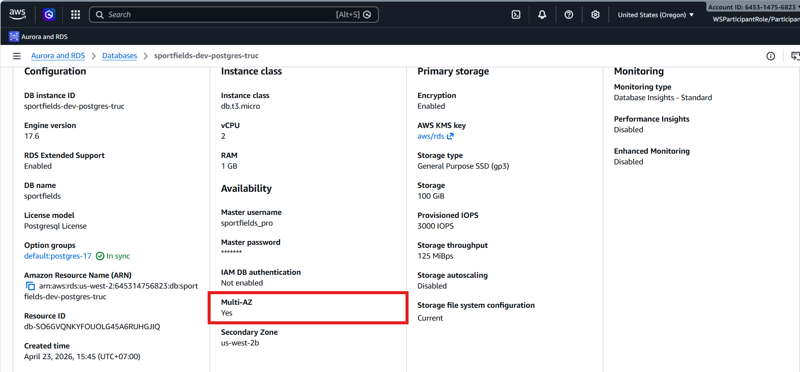

</div>
> **Note:** Mô hình triển khai Multi-AZ đã được kích hoạt (chứng minh qua ảnh chụp và `"MultiAZ": true`). Việc thiết lập cấu hình này nhằm đảm bảo tính sẵn sàng cao (High Availability) và tự động chuyển đổi dự phòng (failover) nếu có lỗi hạ tầng, đây là yếu tố sống còn để ngăn hệ thống đặt sân bị sập (downtime).

### 3.4. Automated Backups Configured
*(Sử dụng cùng CLI Output ở mục 3.1)*
<div align="center">

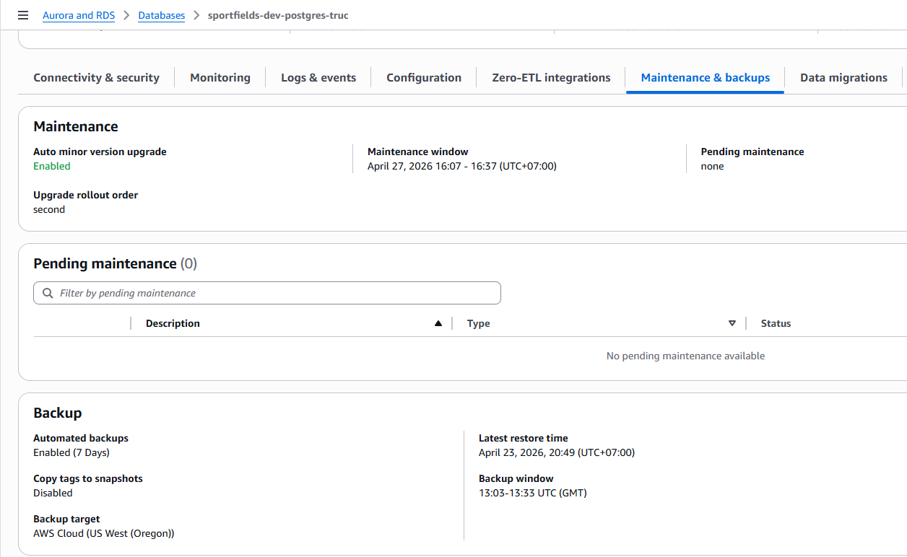

</div>
> **Note:** Hệ thống tự động sao lưu đã được cấu hình với thời gian lưu trữ là 7 ngày (chứng minh qua `"BackupRetentionPeriod": 7`). Thiết lập này đảm bảo chúng em có khả năng khôi phục dữ liệu ở bất kỳ thời điểm nào trong vòng 7 ngày qua (Point-in-time recovery) nếu chẳng may xảy ra sự cố hỏng dữ liệu hoặc do thao tác nhầm của con người.

---

## 4. Working Query Evidence (Bằng chứng truy vấn)

### 4.1. Indexed Lookup Query (Pattern 1)
<div align="center">


</div>
> **Note:** Sử dụng `EXPLAIN ANALYZE` chứng minh câu truy vấn tìm kiếm trạng thái 'FAILED' đã tận dụng thành công Index thay vì Full Table Scan.

### 4.2. JOIN Query qua 2+ bảng (Pattern 3)
<div align="center">


</div>
> **Note:** Chứng minh câu lệnh JOIN 3 bảng (Users, Bookings, Payments) hoạt động mượt mà và trả về dữ liệu thực tế.

*(Optional)* ### 4.3. ACID Transaction (Pattern 2)
<div align="center">


</div>
> **Note:** Chứng minh cơ chế Rollback hoạt động để bảo vệ toàn vẹn dữ liệu khi có lỗi xảy ra giữa chừng.

---

## 5.Bedrock Evidence

### 5.1. Bedrock Retrieve/Generate Response
<div align="center">

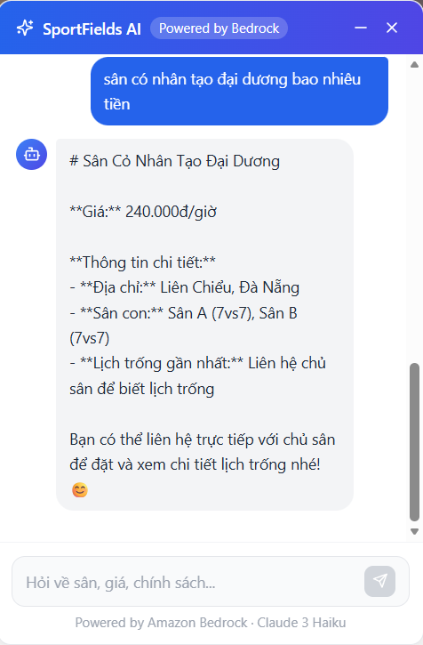

</div>
> **Note:** Kết quả truy xuất từ Knowledge Base qua API/CLI.


### 5.2. AWS Lambda Evidence

#### 5.2.1. Lambda: Auto-Sync Data cho AI Chatbot (Bedrock)
<div align="center">

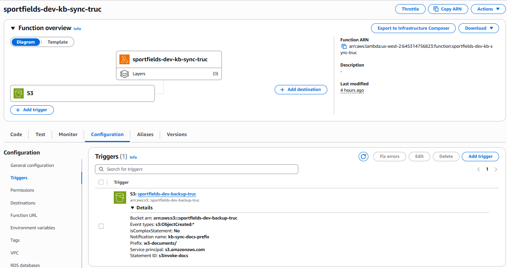

</div>
> **Note:** Hệ thống sử dụng một hàm AWS Lambda được thiết lập Trigger tự động. Hàm Lambda này đảm nhận nhiệm vụ đồng bộ hóa (sync) tài liệu/dữ liệu mới nhất vào AWS Bedrock Knowledge Base. Điều này đảm bảo Chatbot AI luôn tư vấn dựa trên nguồn dữ liệu được cập nhật liên tục mà không cần con người bấm đồng bộ thủ công.

#### 5.2.2. Lambda: Auto-Resize Image trên S3
<div align="center">

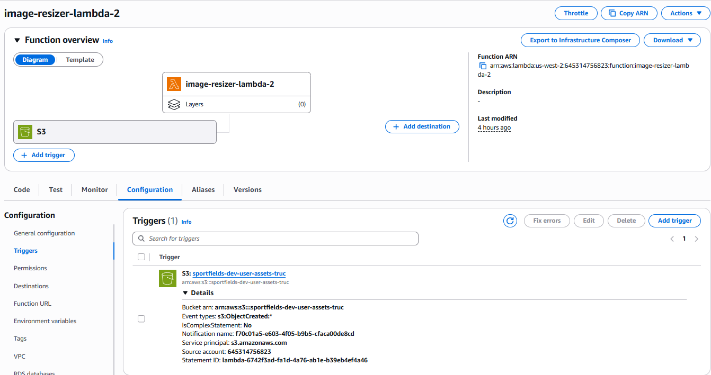

</div>
> **Note:** Hàm AWS Lambda thứ hai được Trigger trực tiếp bởi sự kiện `s3:ObjectCreated:*` trên Amazon S3 bucket. Ngay khi người dùng tải ảnh lên (ví dụ: ảnh đại diện, ảnh sân thể thao), Lambda sẽ tự động được kích hoạt để xử lý nén dung lượng và thay đổi kích thước (resize) ảnh thành các bản thu nhỏ (thumbnail). Kiến trúc Event-driven này giúp tối ưu hóa băng thông tải trang web hoàn toàn tự động phía backend.

---

## 6. VPC + Networking Evidence
### 6.1. Route Table S3 Gateway Endpoint
<div align="center">

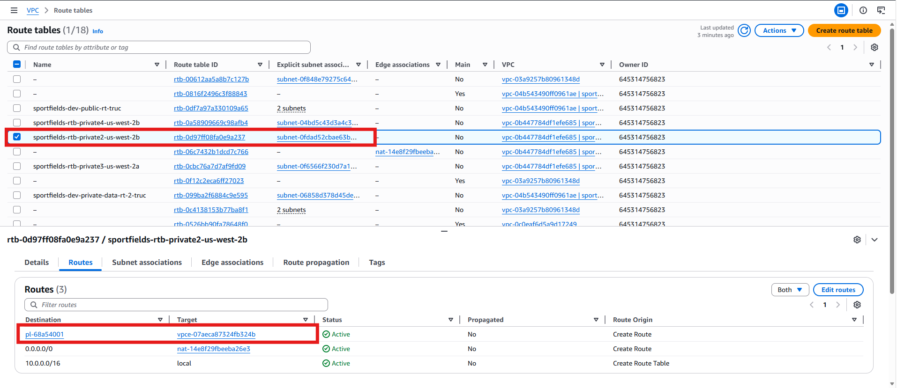

.png>)

</div>
> **Note:** VPC Route table có chứa Endpoint trỏ tới S3, giúp các resource trong Private Subnet truy cập S3 mà không cần đi qua Internet Gateway.

### 6.2. DB Security Group Inbound Rule
<div align="center">

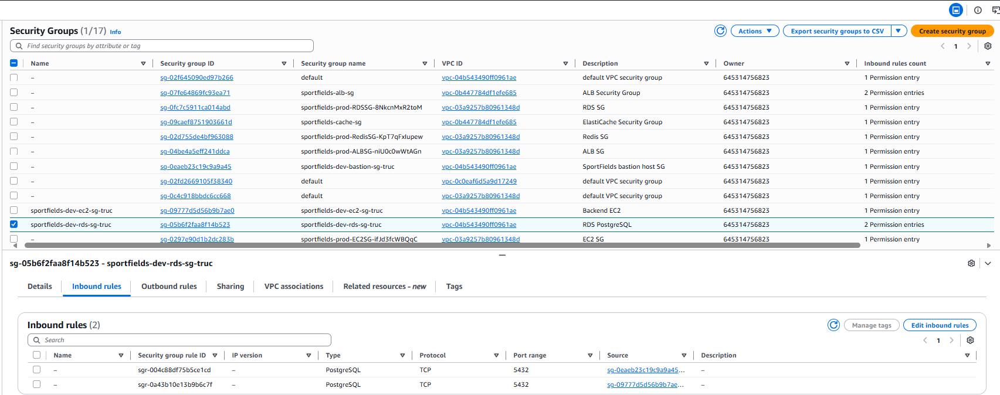

</div>
> **Note:** Rule Inbound của Database SG chỉ cho phép kết nối cổng 5432 từ Source là Security Group của Application Tier (Backend EC2).

---

## 7. Negative Security Test
<div align="center">

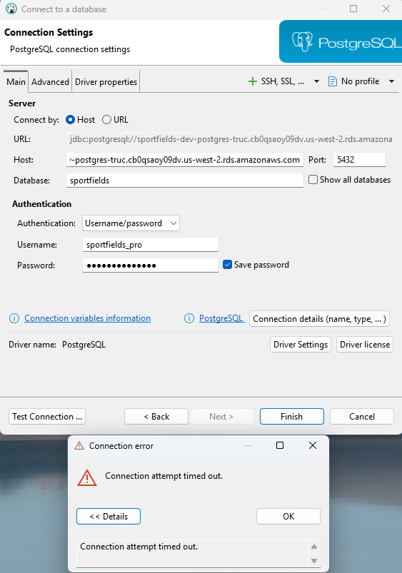

</div>
> **Note:** Chúng em đã thử kết nối trực tiếp vào RDS từ máy tính cá nhân (mạng Internet công cộng). Đúng như cấu hình dự kiến, kết nối đã bị lỗi Timeout/Từ chối vì Database đã được bảo vệ chặt chẽ bên trong mạng kín (Private Subnet) và không mở cổng ra ngoài Internet.

---

## 8. Failover Test & Downtime Measurement (Bonus Scenario)

### 8.1. Pre-state (Trước khi Failover)
<div align="center">

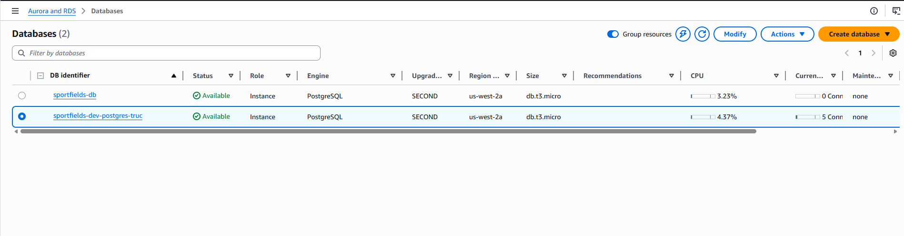

</div>
> **Note:** Hệ thống đang hoạt động bình thường (Available), kết nối tới Database thông suốt. Tính năng Multi-AZ đã được bật.

### 8.2. Action (Kích hoạt Failover)
<div align="center">

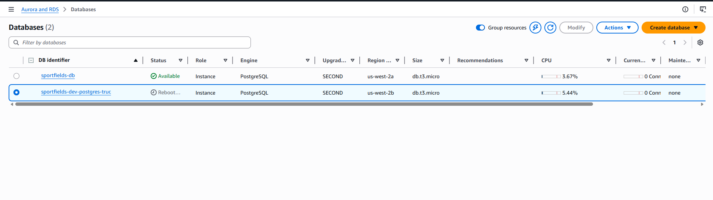

</div>
> **Note:** Thực hiện thao tác Reboot DB Instance và chọn "Reboot với failover" để ép Database chuyển đổi từ Primary node sang Standby node.

### 8.3. Measurement (Đo lường Downtime)
<div align="center">

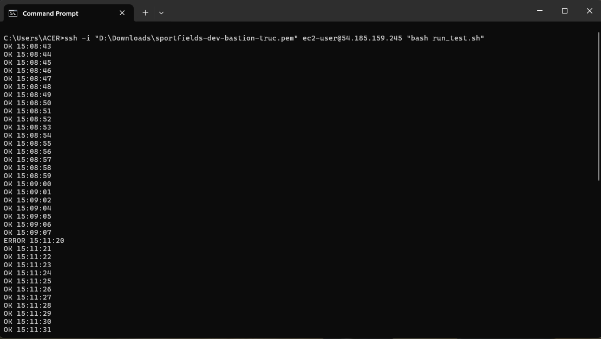

</div>
> **Downtime đo được:** `134 giây` (~2 phút 14 giây)
> *(Ghi nhận thực tế: Mất kết nối từ 15:09:07 đến 15:11:20 do TCP timeout chờ phản hồi trong lúc DB khởi động ở Availability Zone mới. Đến 15:11:21 thì ping thành công trở lại).*


### 8.4. Reflection (Bài học rút ra)
Mô hình Multi-AZ failover giúp hệ thống tự động phục hồi và đảm bảo tính sẵn sàng cao (High Availability) mà không cần con người can thiệp (Endpoint của DB được giữ nguyên, DNS tự động đổi trỏ sang Standby IP). Tuy nhiên, trong quá trình chuyển đổi (switch AZ), ứng dụng vẫn trải qua một khoảng thời gian downtime thực tế là **134 giây** do kết nối TCP cũ bị đứt ngầm khiến client bị treo (hang) chờ timeout. Do đó, đối với ứng dụng chạy trên Production, ở tầng Backend bắt buộc phải lập trình thêm cơ chế **Retry Logic** (có Timeout và Exponential Backoff) để chủ động xử lý các lỗi đứt quãng tạm thời (transient failures) này một cách êm mượt nhất mà không làm crash app.

### 8.5. Phụ lục: Script đo lường Downtime (`run_test.sh`)
Để mô phỏng ứng dụng Backend đang chạy và bắt được chính xác số giây downtime, nhóm đã viết một Shell script và thực thi chạy ngầm trên máy chủ Bastion Host. Script này liên tục chọc vào RDS mỗi 1 giây để kiểm tra kết nối:
```bash
while true; do
  PGPASSWORD='password' psql -h sportfields-dev-postgres-truc.cb0qsaoy09dv.us-west-2.rds.amazonaws.com -U sportfields_pro -d sportfields -c 'SELECT 1;' -t >/dev/null 2>&1
  
  if [ $? -eq 0 ]; then
    echo "OK $(date +%T)"
  else
    echo "ERROR $(date +%T)"
  fi
  sleep 1
done
```

---

## 9. On-Demand Backup & Restore Evidence (Bonus Scenario)

Để chứng minh khả năng phục hồi dữ liệu từ thảm họa (Disaster Recovery), nhóm đã tiến hành kịch bản kiểm thử: **Manual Snapshot & Restore**.

### 9.1. Pre-state (Dữ liệu trước thảm họa)
<div align="center">

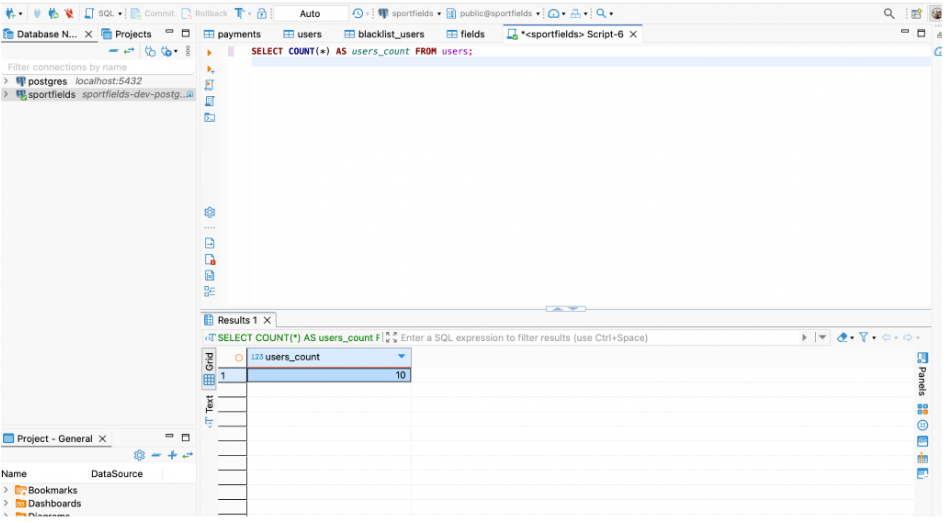

</div>
> **Note:** Chụp trạng thái dữ liệu (số lượng Users) đang tồn tại bình thường trên Database trước khi xảy ra sự cố.

### 9.2. Action 1: Tạo Manual Snapshot
<div align="center">

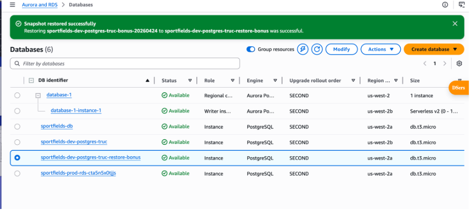

</div>
> **Note:** Thực hiện chủ động tạo một bản sao lưu thủ công (Manual Snapshot) từ Database đang chạy. Thao tác này đảm bảo dữ liệu ở đúng thời điểm hiện tại được đóng băng và lưu trữ an toàn.

### 9.3. Disaster (Mô phỏng thảm họa mất dữ liệu)
<div align="center">

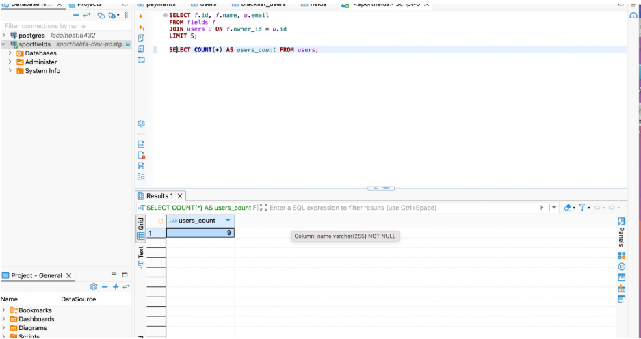

</div>
> **Note:** Chạy câu lệnh `DELETE` để mô phỏng tình huống thao tác nhầm làm mất dữ liệu người dùng. Kết quả truy vấn lúc này cho thấy Users đã bị xóa khỏi hệ thống.

### 9.4. Action 2 & Post-state: Phục hồi (Restore) thành công
<div align="center">

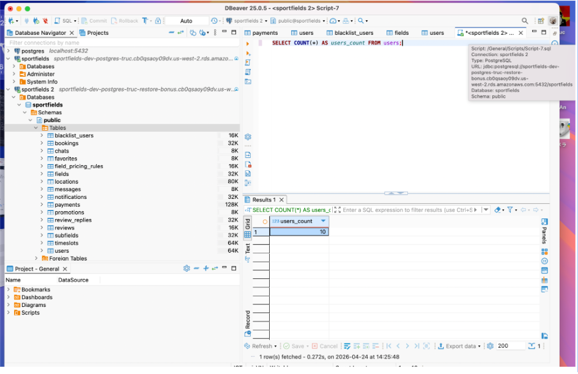
</div>
> **Note:** Khởi tạo một Database Instance hoàn toàn mới từ bản sao lưu thủ công đã tạo ở bước 9.2. Sau khi Database mới khởi tạo xong, kết nối vào Endpoint của Database mới và thực hiện truy vấn lại bảng Users. Kết quả cho thấy dữ liệu đã được khôi phục nguyên vẹn. Kịch bản DR đã thành công.

### 9.5. Reflection (Bài học rút ra)
Tính năng Manual Snapshot (hoặc Point-in-Time Recovery) là chốt chặn an toàn cuối cùng và vô cùng quan trọng đối với các lỗi do "con người" gây ra (Ví dụ: vô tình chạy nhầm lệnh `DROP TABLE` hoặc `DELETE` sai điều kiện) - những lỗi mà kiến trúc Multi-AZ không thể cứu được (vì thao tác xóa sẽ bị sao chép ngay lập tức sang Standby node). 

Tuy nhiên, phương pháp phục hồi này **không phải là giải pháp tức thời (zero-downtime)**. Việc tạo ra một Database Instance mới từ bản Snapshot đòi hỏi thời gian khởi tạo (provision) khoảng 10 - 20 phút. Hơn nữa, Endpoint kết nối của Database mới sẽ thay đổi, đòi hỏi đội ngũ vận hành (Ops) phải cập nhật lại cấu hình chuỗi kết nối (Database URL / `.env`) ở tầng Application thì hệ thống mới có thể hoạt động lại bình thường. Điều này chứng minh rằng: công cụ sao lưu định kỳ của đám mây rất mạnh mẽ, nhưng việc thiết lập quy trình quản lý rủi ro và phân quyền chặn xóa nhầm từ đầu vẫn là ưu tiên số một.
