# 🚀 GeekBrain AI - Weekly 4 Evidence Pack

## Section 1 — Cover
*   **Số nhóm:** 14
*   **LLM sử dụng:** Claude 4 Sonnet via AWS Bedrock (Converse API)
*   **Framework sử dụng:** Raw AWS SDK (boto3) + Streamlit Dashboard
*   **Link repo:** https://github.com/Baronger23/RAG-AI-local

---

## Section 2 — Architecture Overview

### 🗺️ System Architecture Diagram
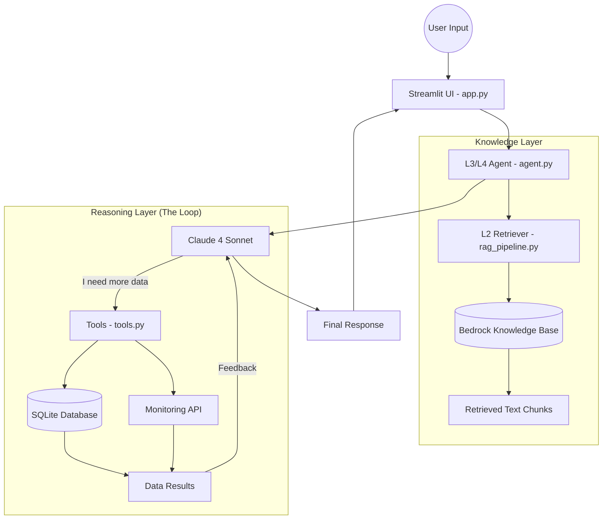
### 📦 Component List
1.  **`app.py`**: Dashboard quan sát (Observability) hiển thị Chat, Chunks trích dẫn và Reasoning logs.
2.  **`agent.py`**: "Bộ não" điều phối. Quản lý vòng lặp suy luận (L3) và bộ nhớ hội thoại (L4).
3.  **`rag_pipeline.py`**: Xử lý truy xuất tài liệu đa nguồn (L1/L2) từ AWS Bedrock.
4.  **`tools.py`**: Tập hợp các công cụ kết nối dữ liệu thực tế (SQL Query & Monitoring API).

### 🔄 Data Flow
1.  **Input:** User hỏi về chi phí hoặc sự cố hệ thống.
2.  **Retrieval:** Hệ thống quét Bedrock Knowledge Base lấy ra các đoạn văn bản (Chunks).
3.  **Reasoning:** LLM nhận Chunks, nếu thấy thiếu thông tin, nó tự động gọi Tool (SQL/API).
4.  **Synthesis:** LLM tổng hợp Chunks + Dữ liệu từ Tool để đưa ra câu trả lời cuối cùng.

**[SCREENSHOT 1: Ứng dụng Streamlit đang chạy và Terminal hiển thị Uvicorn/Streamlit started]**

---

    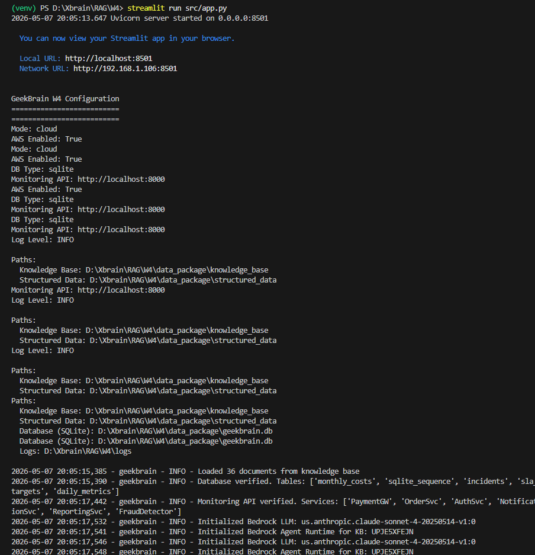

    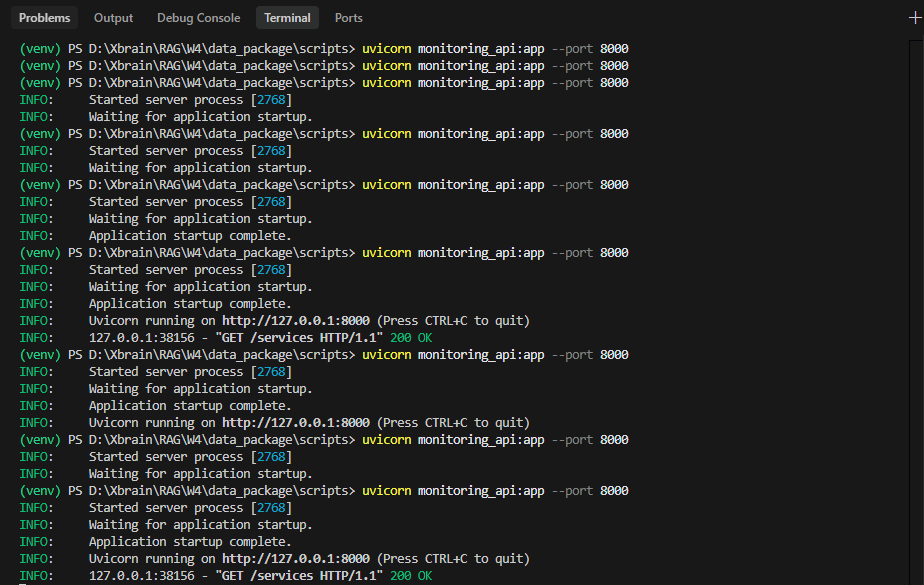

---

## Section 3 — Decision Log

### Quyết định 1: Sử dụng Raw Bedrock Converse API thay vì LangChain
*   **Tại sao:** Để kiểm soát tối đa cấu trúc dữ liệu trả về cho phần Observability Dashboard.
*   **Bài học:** Raw API giúp việc debug các bước Tool Call và Tool Result minh bạch hơn rất nhiều.

### Quyết định 2: Tích hợp "Priority of Truth" (Quy tắc ưu tiên Policy)
*   **Tại sao:** Tránh việc AI bị nhầm lẫn giữa quy định công ty và các thông tin thỏa thuận trong cuộc họp (SLA violation).
*   **Bài học:** AI cần được hướng dẫn cụ thể về tính pháp lý/tuân thủ để đưa ra nhận định chính xác.

### Quyết định 3: Chuyển từ trả về "Tên file" sang trả về "Text Chunks" chi tiết
*   **Tại sao:** Lúc đầu chỉ hiện tên file (fail), Trainer sẽ không biết AI đọc gì. Chúng em đã sửa để hiện chi tiết từng đoạn văn bản.
*   **Cải tiến:** `Chúng em thử hiện tên file, fail vì không đủ bằng chứng, nên chuyển sang hiện đầy đủ Text Chunks kèm Expander.`

---

## Section 4 — Per-Level Evidence

### L1 Evidence: Simple Retrieval
*   **Yêu cầu:** Câu trả lời đúng kèm nguồn trích dẫn.
*   **Câu hỏi ví dụ:** "Who is the lead of Team Platform?"
*   **[SCREENSHOT 2: Kết quả chat hiện tên Alex Chen và phần Retrieved Context hiện file team_platform.md]**

    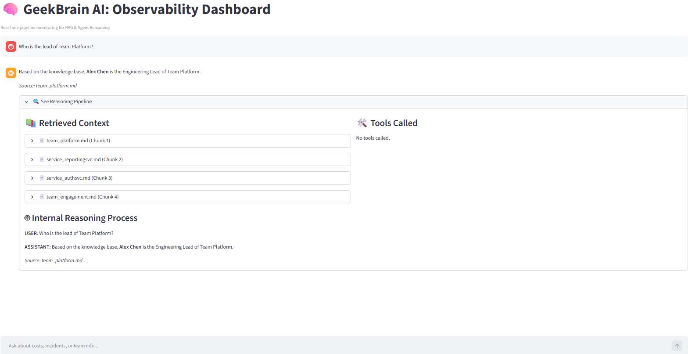

    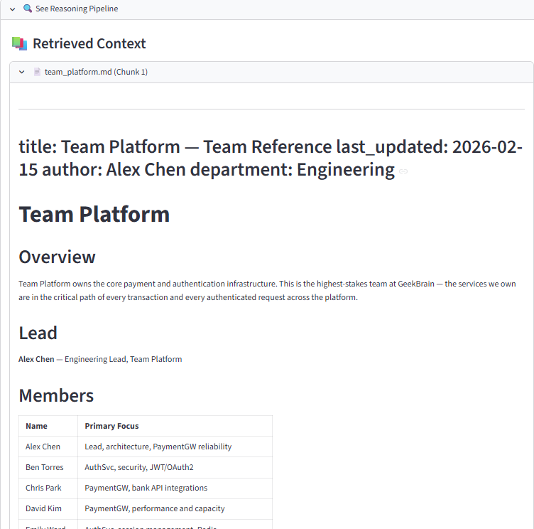

### L2 Evidence: Multi-doc & Conflict Resolution
*   **Yêu cầu:** Xử lý thông tin mâu thuẫn (ví dụ: API rate limit v1 vs v2).
*   **Câu hỏi ví dụ:** "What is the current API rate limit for PaymentGW?"
*   **Xử lý:** Hệ thống nhận diện được cả 2 file v1 và v2, nhưng ưu tiên v2 (1000 requests) theo logic "Newer is better".
*   **[SCREENSHOT 3: Câu trả lời khẳng định 1000 requests và giải thích tại sao không chọn 500]**

    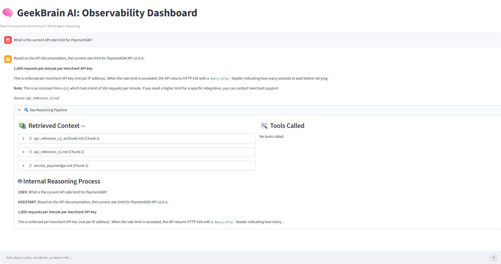

### L3 Evidence: Tool-Augmented RAG (QUAN TRỌNG NHẤT)
*   **Yêu cầu:** Lấy dữ liệu thực tế từ Database.
*   **Câu hỏi ví dụ:** "What was PaymentGW's total cost in Q1 2026?"
*   **[SCREENSHOT 4: Kết quả $16,500]**

    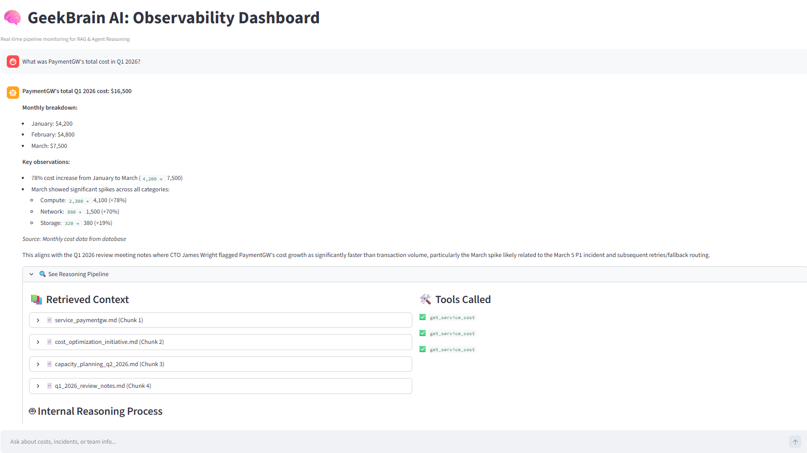

    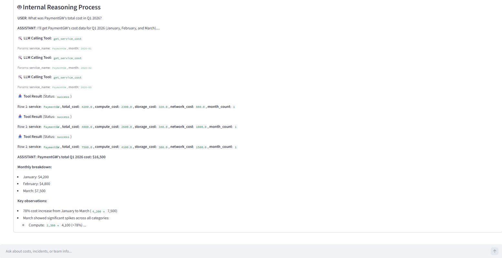

### L4 Evidence: Multi-turn Investigation & Memory
*   **Yêu cầu:** Hội thoại 3-4 bước có tính kế thừa.
*   **Chiến lược:** Sử dụng `ConversationMemory` lưu trữ `messages` history để AI hiểu các đại từ thay thế (it, that, them).
*   **[SCREENSHOT 5: Toàn bộ lịch sử chat 4 câu hỏi liên tiếp về chi phí -> nguyên nhân -> team -> deadline]**

    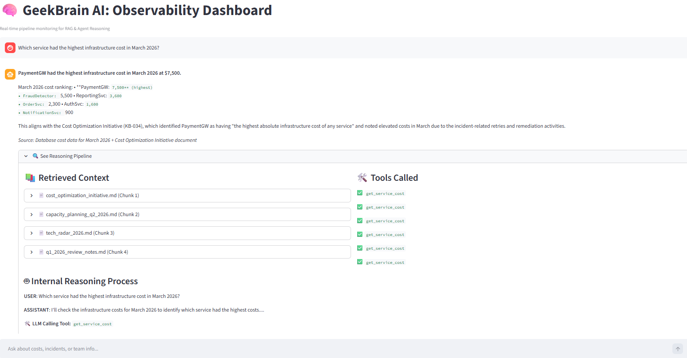

    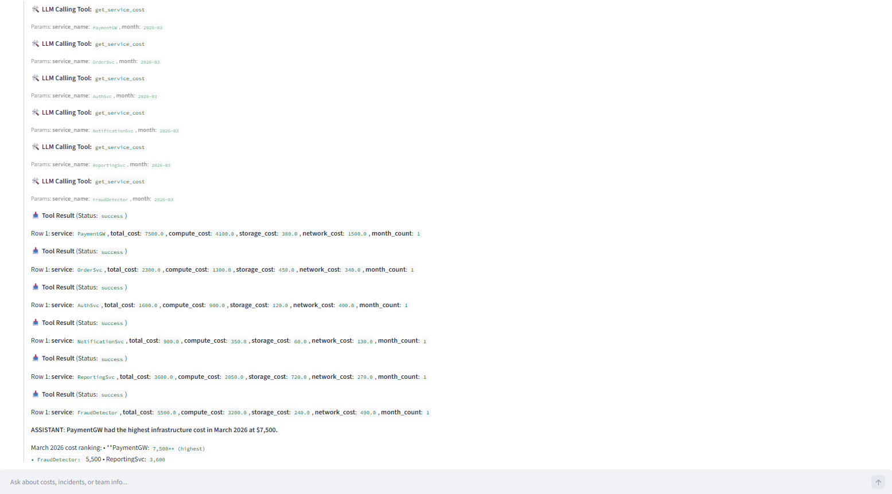

    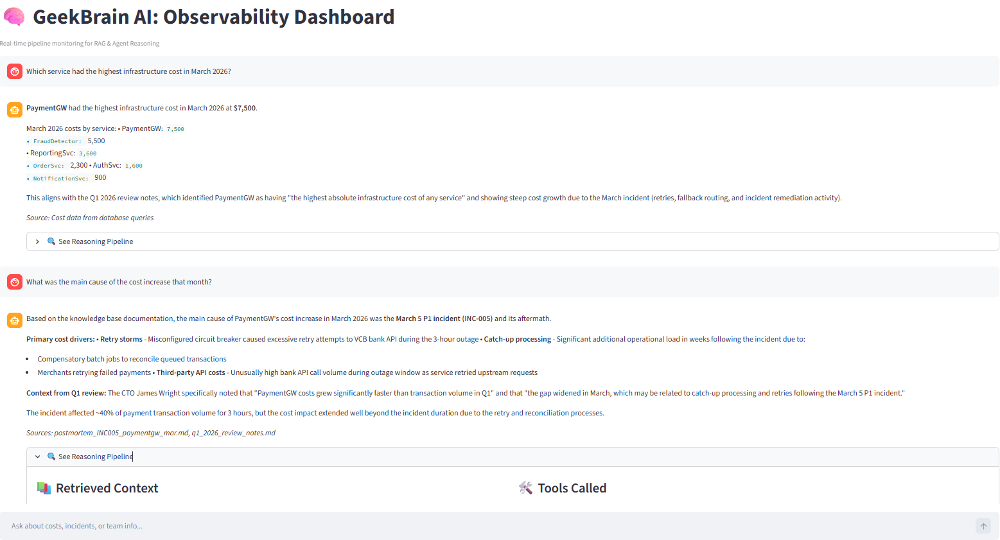

    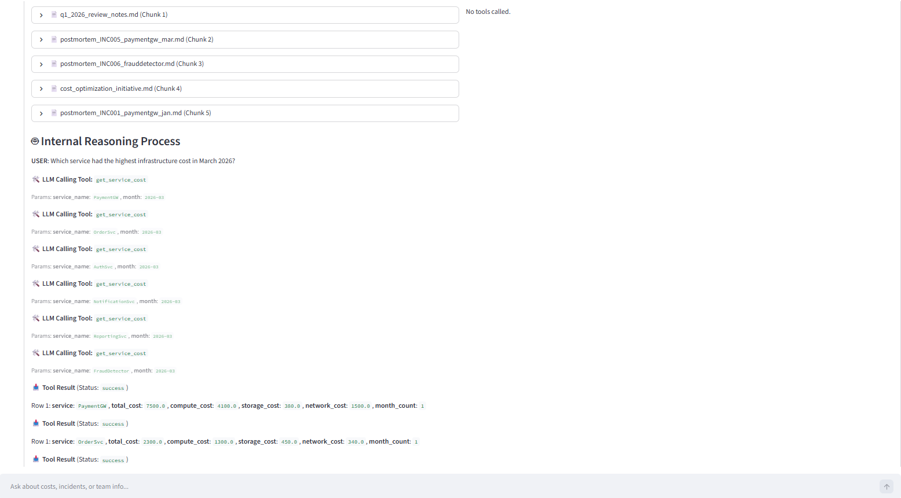

    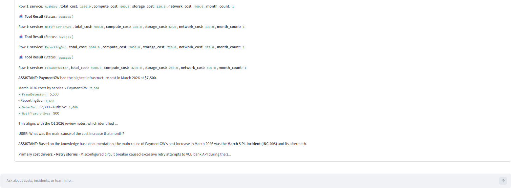

    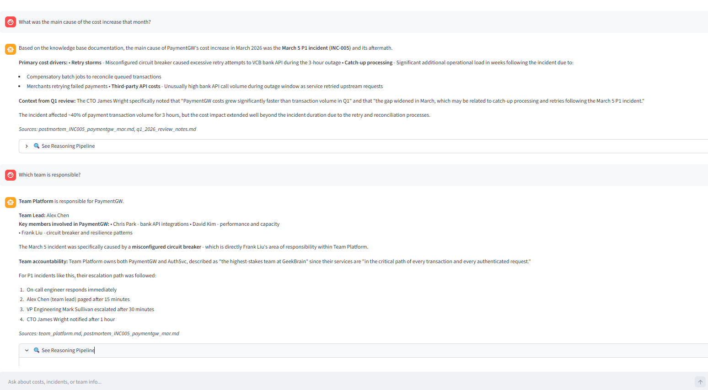

    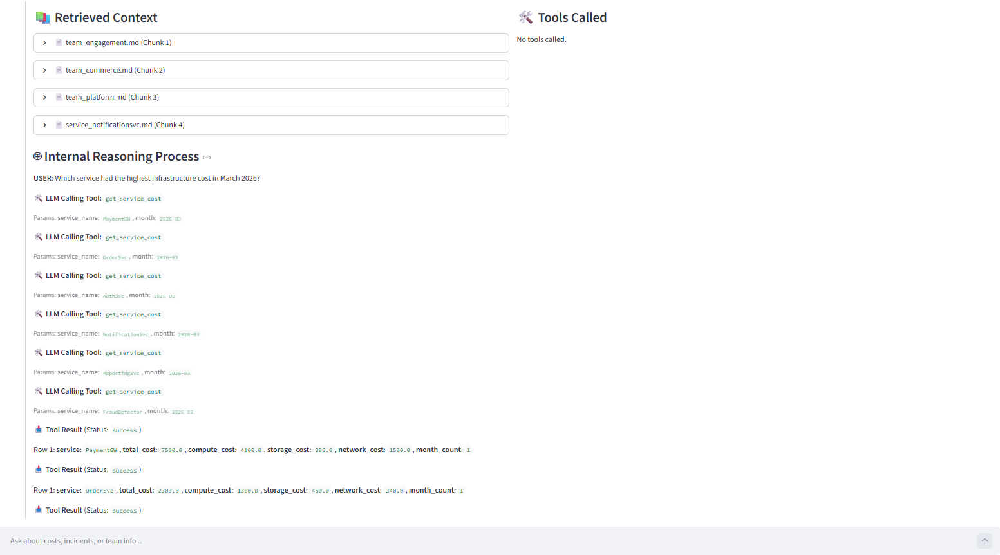

    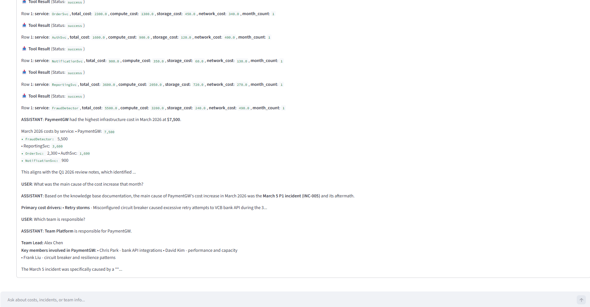

    

    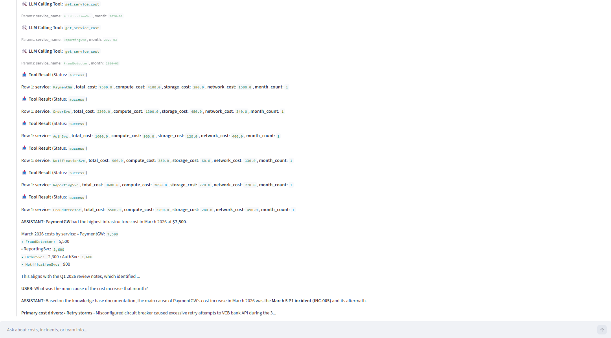

    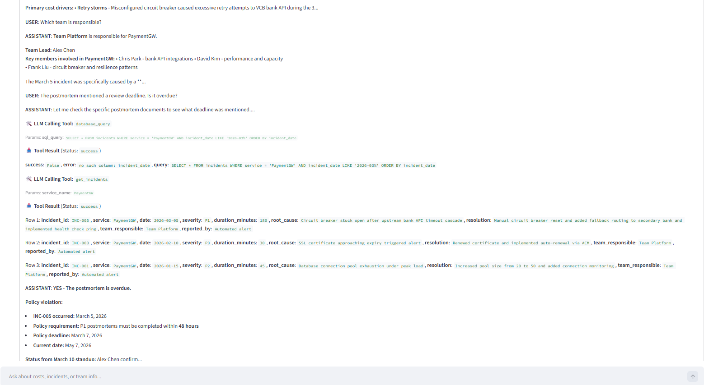

### Bonus A & B: Observability & Reasoning
*   **Bằng chứng:** Dashboard hiển thị real-time các bước Tool Call, Tool Result và suy luận logic.
*   **[Bao gồm những hình ảnh trên: Ảnh chụp bảng 'Internal Reasoning Process' với các icon 🛠️ và 📥]**
### Bonus C: 
---

## Section 5 — Reflection
*   **Cái khó nhất:** Việc ép AI phải thực hiện tính toán ngày tháng chính xác (Date Logic) để phát hiện vi phạm SLA. AI ban đầu hay bị "ảo tưởng" về thời gian.
*   **Nếu có thêm 1 ngày:** Tôi sẽ triển khai thêm tính năng tự động vẽ biểu đồ (Chart) ngay trên Dashboard khi AI lấy được dữ liệu chuỗi thời gian từ Database.
